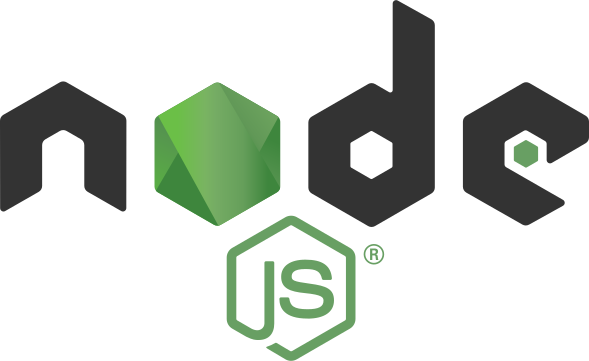

    

## Welcome to My Page! 👋

    Hi, I'm Thach Tong, a Back-End Software Engineer passionate about crafting modern, user-focused web applications.

  

## 👨‍💻 About Me

- 💡 I specialize in developing robust backend systems with **Java** and **Spring Boot**, alongside building dynamic frontends using **React**, **Node.js**, and **MongoDB**, with a focus on clean architecture and performance.
- 🔭 Currently working on: Enhancing enterprise applications with **Spring Boot** and integrating **React** for responsive UIs.
- 📫 Let’s connect! Check out my projects below or reach me on [GitHub](https://github.com/thachtaro2210).

## 📫 How to reach me: 

[LeetCode](https://leetcode.com/u/thachtaro/)
[ GitHub](https://github.com/thachtaro2210/) 

  

⚒️ Tech Stack and Languages - Frameworks - Tools ⚒️

  

## 🛠️ Tech Stack

<table align="center">
  <tr>
    <td align="center" width="140">
      
       SpringBoot
    </td>
    <td align="center" width="140">
      
       NextJS
    </td>
    <td align="center" width="140">
      
       JavaScript
    </td>
    <td align="center" width="140">
      
       TypeScript
    </td>
    <td align="center" width="140">
      
       NodeJS
    </td>
  </tr>
  <tr>
    <td align="center" width="140">
      
       TailwindCSS
    </td>
    <td align="center" width="140">
      
       React
    </td>
    <td align="center" width="140">
      
       NestJS
    </td>
    <td align="center" width="140">
      
       Redux
    </td>
    <td align="center" width="140">
      
       MySQL
    </td>
  </tr>
  <tr>
    <td align="center" width="140">
      
       RESTful API
    </td>
    <td align="center" width="140">
      
       Docker
    </td>
    <td align="center" width="140">
      
       AWS
    </td>
  </tr>
</table>

  

<h2 align="center">🔥 GitHub Stats 🔥</h2>
 

  

 
<!-- <h2 align="center">📌 Pinned Projects</h2>

<!--
 -->

<h3 align="center">
    
</h3>
