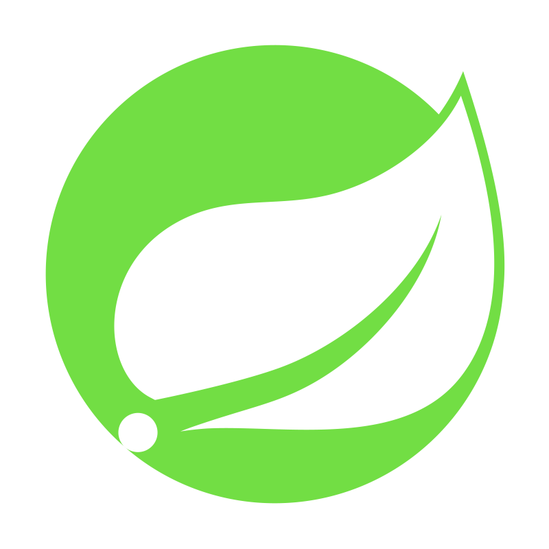
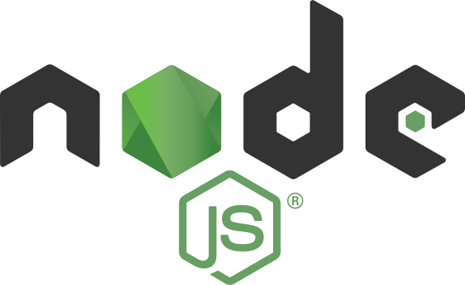

  

## Welcome to My Page! 

    Hi, I'm Thach, a Back-End Software Engineer passionate about crafting modern, user-focused web applications.

##  About Me

-  I specialize in developing robust backend systems with **Java** and **Spring Boot**, alongside building dynamic frontends using **React**, with a focus on clean architecture and performance.
-  Currently working on: Enhancing enterprise applications with **Spring Boot** and integrating **React** for responsive UIs.
-  Let’s connect! Check out my projects below or reach me on [GitHub](https://github.com/thachtaro2210).

##  How to reach me: 

[LeetCode](https://leetcode.com/u/thachtaro/)
[ GitHub](https://github.com/thachtaro2210/) 

⚒️ Tech Stack and Languages - Frameworks - Tools ⚒️

##  Tech Stack

<table align="center">
  <tr>
    <td align="center" width="140">
       SpringBoot
    </td>
    <td align="center" width="140">
       NextJS
    </td>
    <td align="center" width="140">
       JavaScript
    </td>
    <td align="center" width="140">
       TypeScript
    </td>
    <td align="center" width="140">
       NodeJS
    </td>
  </tr>

  <tr>
    <td align="center">
       TailwindCSS
    </td>
    <td align="center">
       React
    </td>
    <td align="center">
       Redux
    </td>
    <td align="center">
       MySQL
    </td>
  </tr>

  <tr>
    <td align="center">
       REST API
    </td>
    <td align="center">
       Docker
    </td>
    <td align="center">
       AWS
    </td>
  </tr>
</table>

 

## 📫 Contact Me
---

- GitHub: https://github.com/thachtaro2210
- LeetCode: https://leetcode.com/u/thachtaro/
- LinkedIn: 
- Email: thatchjeager@gmail.com

<h2 align="center">🔥 GitHub Stats 🔥</h2>

  
  

  

  

<h3 align="center">
    
</h3>
