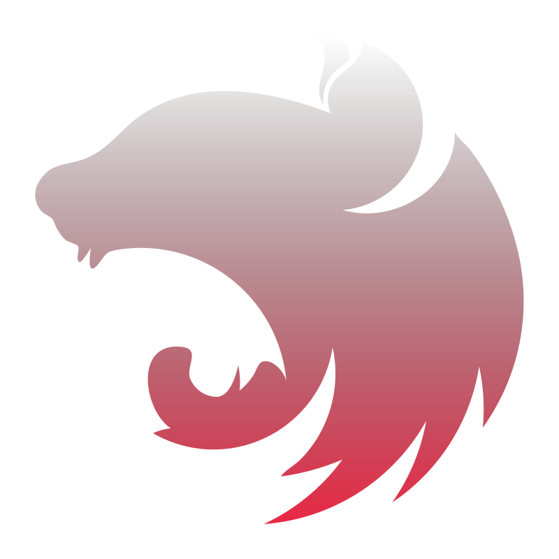

  

## Welcome to My Page! 👋

    Hi, I'm Thach, a Back-End Software Engineer passionate about crafting modern, user-focused web applications.

  

##  About Me

-  I specialize in developing robust backend systems with **Java** and **Spring Boot**, alongside building dynamic frontends using **React**, **Node.js**, and **MongoDB**, with a focus on clean architecture and performance.
-  Currently working on: Enhancing enterprise applications with **Spring Boot** and integrating **React** for responsive UIs.
-  Let’s connect! Check out my projects below or reach me on [GitHub](https://github.com/thachtaro2210).

##  How to reach me: 

[LeetCode](https://leetcode.com/u/thachtaro/)
[ GitHub](https://github.com/thachtaro2210/) 

⚒️ Tech Stack and Languages - Frameworks - Tools ⚒️

##  Tech Stack

<table align="center">
  <tr>
    <td align="center" width="140">
      
       SpringBoot
    </td>
    <td align="center" width="140">
      
       NextJS
    </td>
    <td align="center" width="140">
      
       JavaScript
    </td>
    <td align="center" width="140">
      
       TypeScript
    </td>
    <td align="center" width="140">
      
       NodeJS
    </td>
  </tr>
  <tr>
    <td align="center" width="140">
      
       TailwindCSS
    </td>
    <td align="center" width="140">
      
       React
    </td>
    <td align="center" width="140">
      
       NestJS
    </td>
    <td align="center" width="140">
      
       Redux
    </td>
    <td align="center" width="140">
      
       MySQL
    </td>
  </tr>
  <tr>
    <td align="center" width="140">
      
       RESTful API
    </td>
    <td align="center" width="140">
      
       Docker
    </td>
    <td align="center" width="140">
      
       AWS
    </td>
  </tr>
</table>

  

  

 

## 📫 Contact Me
---

<!--
**** is a ✨ _special_ ✨ repository because its `README.md` (this file) appears on your GitHub profile.

Here are some ideas to get you started:

- 🔭 I’m currently working on ...
- 🌱 I’m currently learning ...
- 👯 I’m looking to collaborate on ...
- 🤔 I’m looking for help with ...
- 💬 Ask me about ...
- 📫 How to reach me: ...
- 😄 Pronouns: ...
- ⚡ Fun fact: ...
-->

<h2 align="center">🔥 GitHub Stats 🔥</h2>

  
  

<h3 align="center">
    
</h3>
